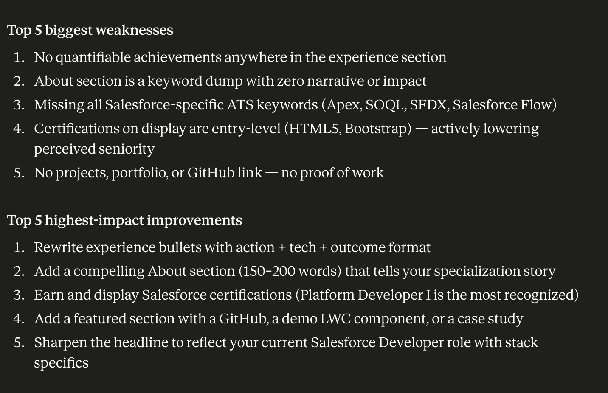
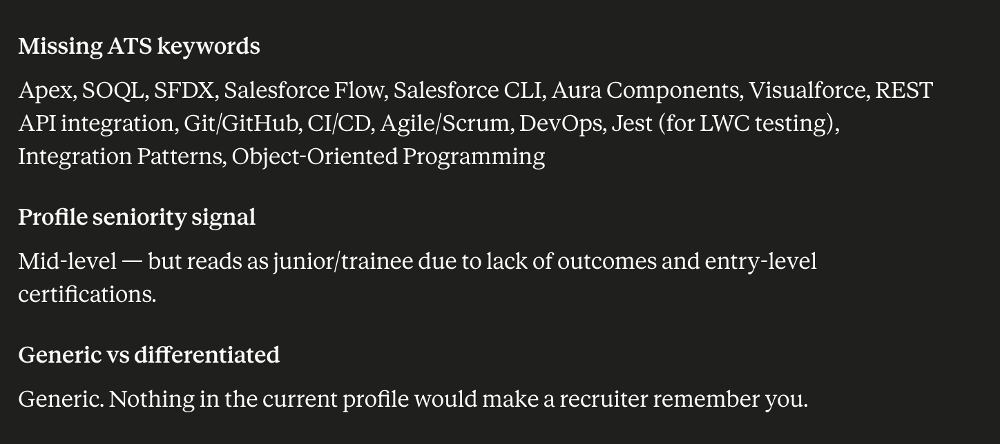
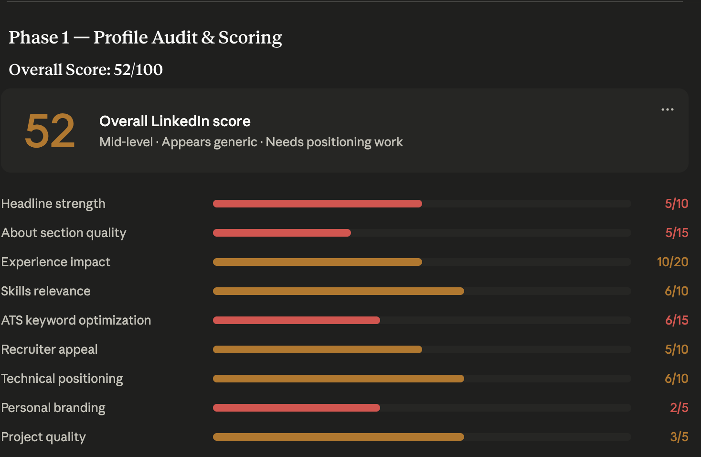

# LinkedIn Profile Analysis Skill for Claude Desktop

An advanced LinkedIn Profile Analysis and ATS Optimization skill for Claude Desktop / Claude Code.

**Author:** [Uriti Sai Abhishek](https://www.linkedin.com/in/uritisaiabhishek/)

This skill:
- Reviews LinkedIn profiles like a recruiter
- Gives ATS and recruiter score
- Identifies weak sections
- Rewrites headlines and About sections
- Optimizes experience bullets
- Suggests missing skills and keywords
- Improves recruiter appeal and personal branding
- Supports LinkedIn PDF profile uploads

---

# Features

## Profile Scoring
Scores profile across:

- Headline Strength
- About Section Quality
- Experience Impact
- ATS Optimization
- Recruiter Appeal
- Technical Positioning
- Personal Branding
- Skills Relevance
- Project Quality

---

## ATS Optimization
Detects:
- Missing recruiter keywords
- Weak technical positioning
- Generic wording
- Missing skills for target role

---

## Profile Rewrite
Generates:
- Optimized LinkedIn headline
- Strong About section
- Achievement-based experience bullets
- Skills categorization
- Branding improvements

---

## Recruiter Simulation
Simulates a recruiter reviewing the profile for 15 seconds and explains:
- First impression
- Biggest concern
- Strongest signal
- Shortlist probability

---

# Screenshots

## Skill in Use



## Analysis Output Example



## Profile Score Example



---

# Installation

## Step 1 — Open Claude Desktop

Install Claude Desktop:

- macOS
- Windows

Launch the application.

---

## Step 2 — Download the Skill File

Download the `linked-in-profile-builder.skill` file from this repository.

---

## Step 3 — Upload to Claude Skills

For Claude Web & Desktop App:

1. Locate the Skill File: Find the `linked-in-profile-builder.skill` file you downloaded
2. Open the Menu: Navigate to the Co-work tab on the left sidebar, click Customize, and then select Skills
3. Upload the Skill: Click the + (plus) icon at the top and select Upload a skill
4. Drop the File: Drag and drop the `linked-in-profile-builder.skill` file into the upload area. Claude will automatically process it
5. Activate: Ensure the toggle next to the newly installed skill is turned on

---

## Step 4 — Restart Claude Desktop

Completely close Claude Desktop and reopen it.

The skill should now be available.

---

# Usage

Inside Claude Desktop:

```text
Use linkedin-profile-analysis skill
```

Then upload:

* LinkedIn PDF
* Resume
* Portfolio
* GitHub profile
* Target job role

---

# Recommended Inputs

Best results when providing:

* LinkedIn PDF export
* Resume
* Job description
* Target role
* Portfolio links
* GitHub links

---

# Recommended Workflow

1. Export LinkedIn Profile PDF
2. Upload PDF to Claude
3. Run skill
4. Review score breakdown
5. Apply rewritten sections
6. Re-run analysis after updates

---

# Future Improvements

Potential upgrades:

* Resume analysis
* GitHub repository analysis
* Job description matching
* Interview preparation
* Personal website audit
* AI-generated LinkedIn banner
* Recruiter persona simulation

---

# Author

Created by Uriti Sai Abhishek

Connect with me on LinkedIn: https://www.linkedin.com/in/uritisaiabhishek/

---

# License

MIT


if useing browser version of claude:
navigate to URL : https://claude.ai/customize/skills then press add skill and select the linked-in-profile-builder.skill file